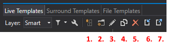

# Templates

This project / repository contains several different Templates for Visual Studio and ReSharper.

## Folders
- ItemTemplates: Templates for files like a *markdown* file.
- ProjectTemplates: Templates for projects like a WPF Application.
- ReSharperTemplates: Templates for ReSharper

## Installation

> **Note**: The following paths refer to the standard installation of Visual Studio and ReSharper.

### Item templates
Copy the ZIP file into the following folder:

```
C:\Users\[User]\Documents\Visual Studio 2019\Templates\ItemTemplates\
```

### Project templates
Copy the ZIP file into the following folder:

```
C:\Users\[User]\Documents\Visual Studio 2019\Templates\ProjectTemplates\Visual C#
```

### ReSharper templates
1. Open the template explorer (*Extensions > ReSharper > Tools > Template Explorer...*)
2. Hit the *Import...* (number 6) button

    

3. Select the desired template.